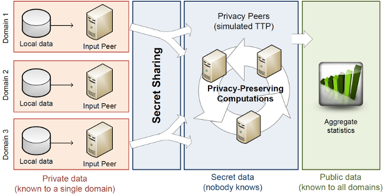

P2DS Workflow
=============

Recall the graphic from the README:

Let's say we have three organisations, called Domain 1, Domain 2, and Domain 3 in the graphic, that want to know the total number of attacks seen in the last 24 hours, with a granularity of five minutes. In mathematical terms, what these organisations want is *x*1 + *x*2 + *x*3, where *x*1, *x*2, and *x*3 are vectors with 24*60/5 = 288 elements, and they want to do this without revealing their own *xi* to any of the other domains. Here is how the three domains could use P2DS for their needs.

# Step 1: Setting Up

This section describes how to set up the group management and the various peers. Some actions have to be done only once, whereas others have to be done for each new computation.

## Step 1.1: Set Up Group Management

## Step 1.2: Set Up Peers

## Step 1.2: Generate Certificates

This process is also described in SEPIA's [User Manual](http://www.sepia.ee.ethz.ch/download/v0.9.1/UserManual.pdf).

First, each organisation generates a public key certificate for each input and privacy peer. There must also be a certificate for the group management service.

Key generation and management is something that is done vastly differently from organisation to organisation. We sketch here a process that will work with Java's keytool; if your organisation follows a different process, use that. The important thing is that at the end, you have a Base64-encoded self-signed X.509 certificate.

In this example, we first generate a 2048-bit RSA key, which conforms to current best practices; Each organisation should replace the names `privacypeer01` with a name that they are more comfortable with. Each organisation *must* replace `privacypeer01KeyPass`, which will be the password that unlocks the private key and `privacypeer01StorePass`, which will be the password that unlocks the keystore.

This command line will generate the key pair, asking for some information about the organisation in the process. This information will be embedded into the key pair.

~~~bash
keytool -genkey -v \
  -alias privacypeer01Alias \
  -keystore privacypeer01KeyStore.jks \
  -storepass privacypeer01StorePass \
  -keypass privacypeer01KeyPass \
  -keyalg RSA \
  -keysize 2048
~~~

Next, generate a self-signed certificate, again replacing the various names with the ones that your organisation has chosen.

~~~bash
keytool -export \
  -alias privacypeer01Alias \
  -keystore privacypeer01KeyStore.jks
  -storepass privacypeer01StorePass \
  -file privacypeer01Certificate.crt \
~~~

We will later describe how to upload these certificates to the Group Management.

# Step 2: Define a Computation

Now, all the organisations need to get together and define what they want to compute. In this example, it's *x*1 + *x*2 + *x*3, where each *xi* is a 288-elements, and they want to do this without revealing their own *xi*. This must be done outside the P2DS framework, and there are important details to consider that are not part of the framework.

One such detail is the question of time synchronisation. If the local clocks of the IDSes are skewed, then so will be the *xi*. Worse, if the clocks also show significant drift, the *xi* will also drift and the final computation will be more noisy and more unreliable. We recommend to connect each timestamping participant to an NTP stratum 1 server (or to connect a stratum 0 time source to it of course).

Once that is decided... (describe here group management -> New Computation -> ...)

# Step 3: Define the Group

Now it's time for the organisations to decide what the peers are that will take part in that computation. They need to drill holes in their firewalls, set up the peers, ...

Then the group manager can either create a new group in the Group Management GUI or reuse an existing one and link the computation defined in the previous step with that group.

# Step 4: Prepare the Data

Now the Input Peers need access to the data.

# Step 5: Launch the Computation

# Step 6: Look at the Results