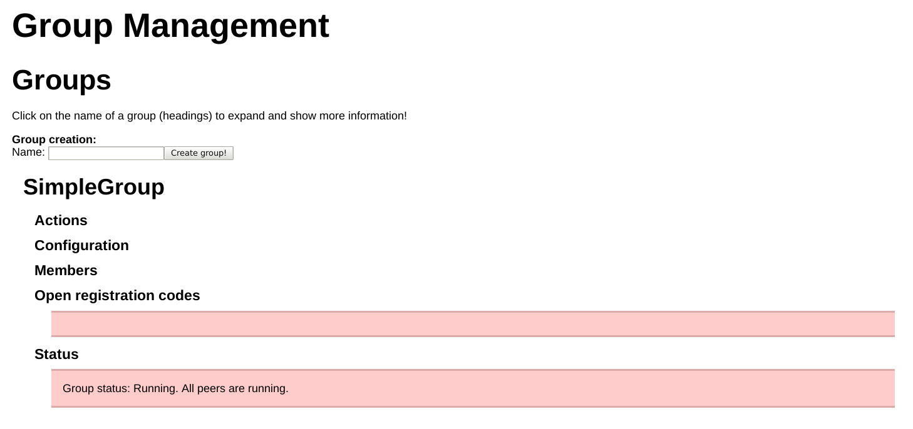
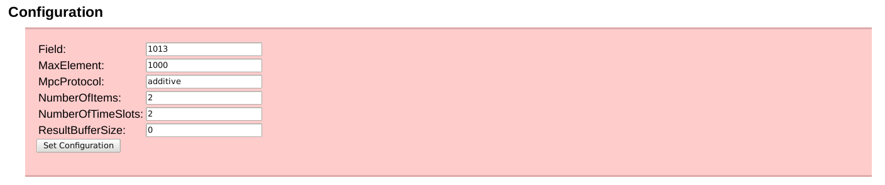
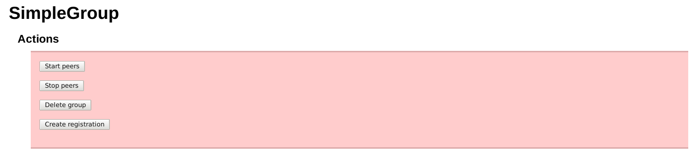
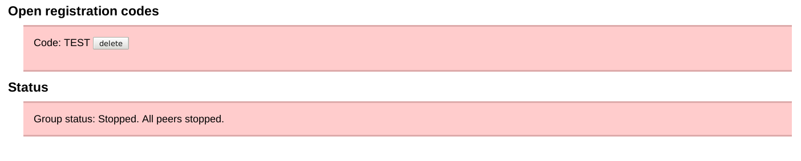
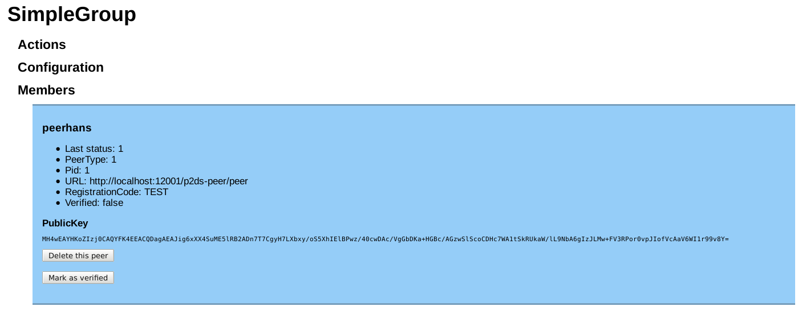
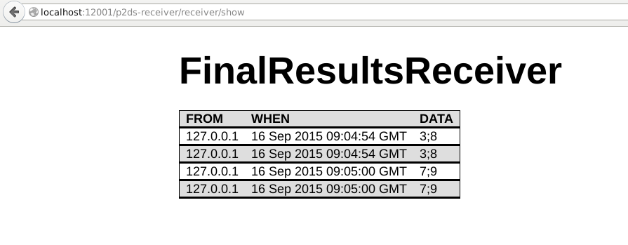

P2DS User and Programmer's Guide
================================

# Performing a Computation

This part manual is written mainly for the person who runs the group manager. If you run a peer, start reading from here.

## Creating a Group

First, locate your administration key. This can be given to you by the person who installed the group manager WAR file, since it is contained in the web services `web.xml` file. This administration key should always be appended to any administration URL. For example, if the group manager is installed on `grpman.example.com`, then the initial URL should be `https://grpman.example.com:8080/p2ds-group-management?adminKey=key`. (Obviously, substitute the correct port numbers and key value.)

Navigate to the group manager GUI (typically .../p2ds-group-management/). There you will initially see a simple form field, asking you to supply a group name. Let's say you enter "SimpleGroup" and click on "Create group!".  When you return to the main page and click on the name of your group, you will see something like this:



Next, you should set up a configuration. This configuraiton says what you want to compute and how to compute it. If you click on "Configuration", you should see the following.



The first element to fill in is "MpcProtocol". This answers the question "what do you want to compute?". The only protocol we have definitive demand for is "additive", meaning that you can compute a vector sum. So you have to put "additive" in that row. (Other protocols include *top-k*, where you can compute the top k elements of each column. For example, the maximum element would be top-1. However, at the time of writing, we have no demand for that protocol, and, while it is implemented, we do not support it.)

The next element you should fill in is "MaxElement". This is the largest intermediate result you envisage. For "additive" it's the largest value you think will occur in a result vector.  For example, if you sample "number of attacks" in 1-minute intervals, you should hardly expect more than 1000 attacks, so 1000 is a good value.

Next should be "Field". This is a prime number larger than MaxElement. In our case, 1013 does the trick. If you are in doubt, you can put the value 2<sup>63</sup> - 5 = 9223372036854775783 in that field, even though computations in that field will take longer.

Next you should take care of NumberOfTimeSlots and NumberOfItems. What this means is that of you have N = m x n items, you will serve these items n at a time, m times. For example, let's say you have 6 numbers in your vector. You can choose to compute the vector sum by adding up two numbers, three times; three numbers, two times; one number, six times; or six numbers, once. They will all give the correct result, but some settings will be faster than others, and some settings will also be more robust.  For example, if you have more items (large n), the computation will generally be faster, but if you have more time slots (large m), the computation will be more robust against peers failing occasionally. (In R terms, you can have a few "N/A" terms in your result vector.)

A special value for NumberOfTimeSlots is "-1". This value will cause the peers to run in *streaming mode*. Usually, peers will run for NumberOfTimeSlots time slots and then shut down. When peers are running in streaming mode, they will forever wait for the next batch of numbers to process. Upside: you don't have to initiate a new computation when you have new data. Downside: one downed or stuck peer will cause the whole computation to stall.

Finally, you can set ResultBufferSize to control in how many chunks the results are sent to the configured result endpoint (see the configuration guide on how to configure this). If you have ten timeslots and set the result buffer size to 1, then ten final results (one per timeslot) will be sent to the result endpoint. If you configure the result buffer size to be 10, only one large result will be sent, after all timeslots have completed.

If the computation fails, no results are sent.  If a peer fails, restart the computation.

## Registering the Peers

Next, talk to the administrators of all the participating organisations and give them the URL of your group manager service. They should deploy and configure a peer service on one of their application servers.

Now you can generate registration codes. These codes are one-time codes that peers use to authorise their registration. If you plan on having m input peers and n privacy peers, klick the "Create registration" button m + n times:



For each registration code, you should see one "Open registration code":



Give one code per peer to the admins. They will need these codes to register the peers with the group manager.  Eventually, you will find a picture like this:



Here we show only one peer, but every peer should be present. Peers have registered, and in registering, they have used up one of the registration codes. There should therefore be no open registration codes at this point.

Peers have registered, but they have not been activated. Only activated peers can participate in the protocol. To do that, talk to each of the admins of each participating organisation and read the public key of their peers to them. These should be identtical to the public keys of those peers that the admins have configured for their peers. Once that is done, click on "Mark as verified". Rinse and repeat until all peers are verified.

The reason there is an additional verification step is that in principle, everyone can register a peer, but only you, the group manager, gets to decide who can participate in a computation. This step also serves as an authentication step to make sure that the public keys you got from the peers are authentic. This saves you from the hassle that is PKI.

## Starting the Peers

Starting the peers is very simple: go to "Actions" and click on "Start peers":


Once that is successful, you should see that "All peers are running":


## Giving the Peers Some Inputs

Once you have created input and privacy peers (refer to the API guide how to do that), you need to give them some inputs. Ideally, you have a web service that does that for you, but if not, you can do that by hand, using `curl`. Let's say that your peer is called `swisscom:ddos-input-peer-1` and that your NumberOfItems in the peer configuration (see the Group Manager guide above) is 6, since you are sampling every 10 minutes per hour. You have seen 1, 4, 2, 8, 9, and 23 DDoS-attempts, respectively, so there is clearly something going on. Your peer runs on `p2ds.swisscom.ch:8080` and your registration code is `JKSdh3h7njs` (this is part of the peer service's configuration). Here is how to supply the peer with that input row:

```bash
curl -i -v -X POST --header "Content-Type: application/json" \
  -d '{"peerName":"swisscom:ddos-input-peer-1","data":"1;4;2;8;9;23"}' \
  https://p2ds.swisscom.ch:8080/p2ds-peer/input?registrationCode= JKSdh3h7njs
```

## Viewing the Results

The input peers report results back to a URL that is set in the peer's configuration (the `finalResultsURL` property). We deliver a very simple results viewer with P2DS, which runs under `/receiver`. If you configure your input peer's `finalResultsURL` to read 
https://p2ds.swisscom.ch:8080/receiver/receive (substitute correct protocol, hostname, and port), then your results might look like this:



## Useful Hints

* *Always* use https, *never* use plain http when feeding data to the input peers. The value of P2DS would be greatly diminished if the supposedly secret data were sent in plain text. The protocol between the peers can be plain http, since P2DS uses encrypted shares already and additional encryption doesn't buy you much security.
* *Always* use https for talking to the group manager.

# Using the APIs

Please refer to the [API Documentation](http://docs.p2dsgroupmanager.apiary.io/#). Exemplary usage of the APIs can be found in the file `grp.sh` in the source code's main directory, available from [the github page](https://github.engineering.zhaw.ch/neut/p2ds.git).

Here is a more verbose version of that file (with some parts skipped to keep this guide shorter).  We assume that the admin key is `default-admin-key` and that the registration codes for all peers is `TEST`.

Please don't use `default-admin-key` and testmode in a production setting.

If you just want to experiment and/or play around otherwise on the shell using curl setting testmode to `on` can be quite convenient. If in testmode the registration codes generated by the group management service will not be random and *Please don't use testmode=on in production*.

```bash
#Set group-mgmt service to test mode
#Don't do that in production!
curl -i -v -X POST http://localhost:12001/p2ds-group-management/group-mgmt/testmode?on=true\&adminKey=default-admin-key
```

To get started we need to create a group on the group management service:

```bash
curl -i -v -X POST --header "Content-Type: application/json" -d '{"name":"SimpleGroup"}' http://localhost:12001/p2ds-group-management/group-mgmt/group?adminKey=default-admin-key
```

Once we have a group we can generate registration codes for peers. The registration code is used by the peers to sign-up for a group. From the output of the previous command (see above) we know the id of the group (in this case ``1``)

```bash
curl -i -v -X POST http://localhost:12001/p2ds-group-management/group-mgmt/registration/1?adminKey=default-admin-key
```

The above command will give the group management admin a registration code that the admin needs to communicate to the peer operator. In this case the registration code is ``TEST``. The peer operator can now create a peer (named ``peerhans``) on the peer service:

```bash
curl -i -v -X POST --header "Content-Type: application/json" -d @./demo/files/peerhans.json http://localhost:12001/p2ds-peer/peer?adminKey=default-admin-key
```

``./demo/files/peerhans.json`` contains the configuration of the peer:

```json
{
  "finalResultsURL":"http://localhost:12001/p2ds-receiver/receiver/receive",
  "peerType":1,
  "name":"peerhans",
  "privateKey":"MFECAQAwEAYHKoZIzj0CAQYFK4EEACQEOjA4AgEBBDNyjBeP85atxkIfiYqW+0kUB2H3guXcQWXT/tXVktbn3MyUdRmNIL99G3rK1XoGSRAM6js=",
  "publicKey":"MH4wEAYHKoZIzj0CAQYFK4EEACQDagAEAJig6xXX4SuME5lRB2ADn7T7CgyH7LXbxy/oS5XhIElBPwz/40cwDAc/VgGbDKa+HGBc/AGzwSlScoCDHc7WA1tSkRUkaW/lL9NbA6gIzJLMw+FV3RPor0vpJIofVcAaV6WI1r99v8Y=",
  "registrationCode":"TEST",
  "groupMgmtURL":"http://localhost:12001/p2ds-group-management/group-mgmt"}
```

``privateKey`` and ``publicKey`` must be PKCS resp. X.509 encoded as base64. *Please generate your own keypairs*. ``peerType=1`` refers to an ``input peer`` where as ``peerType=2`` refers to a ``privacy peer``.

The peer will automatically sign-up for group membership and will be a member of the group on the group management service but marked as ``unverified``. The peer operater and group admin should exchange fingerprints of the public key to verify the identity of the peer. If the group admin has verified the keys he can then mark the peer as verified:

```bash
curl -i -v -X POST http://localhost:12001/p2ds-group-management/group-mgmt/verify/hanspeer?adminKey=default-admin-key\&verified=true
```

Before we can start any peers we need to set a group configuration. The group configuration defines the parameters of the computation to do:

```bash
curl -i -v -X POST --header "Content-Type: application/json" -d '{"field":"1013","gid":"1","maxElement":"1000","mpcProtocol":"additive","numberOfItems":"2","numberOfTimeSlots":"2"}' http://localhost:12001/p2ds-group-management/group-mgmt/configuration?adminKey=default-admin-key
```

Please note that you will need at least three privacy peers and two input peers for the cryptographic protocol to work. You can start peers individually or let the group management service start all peers together. You can start individual peers by doing:

```bash
curl -i -v -X POST http://localhost:12001/p2ds-peer/start/hanspeer?registrationCode=TEST
```

Please note that the registration code is used as a means of *authentication* to prevent anybody from starting a peer. It is thus important that registration codes remain secret and are only known the the group management admin and the peer operator of the corresponding peer. 

Once we have started all peers (in the case of ``grp.sh`` you will have two input peers and three privacy peers) we can add inputs:

```bash
curl -i -v -X POST --header "Content-Type: application/json" -d '{"peerName":"hanspeer","data":["1;3","4;5"]}' http://localhost:12001/p2ds-peer/inputs?registrationCode=TEST
```
